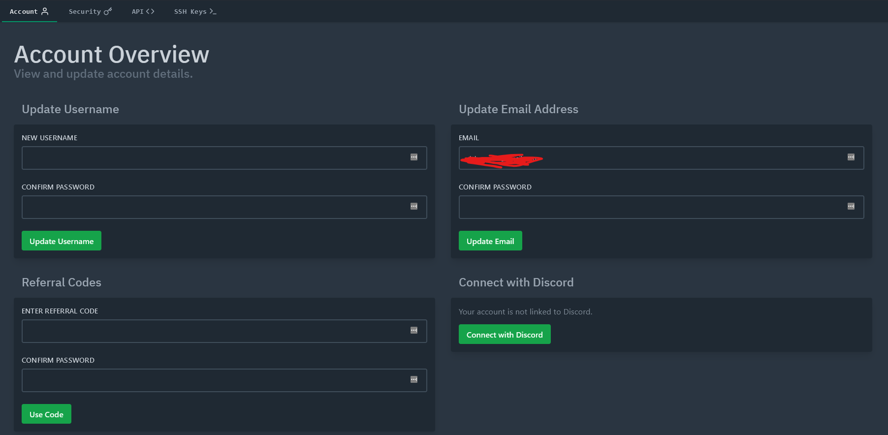

# 📂 File Management

### Via the panel

You can modify servers files using the web file editor.

#### FAQ

How to move the files to the root folder: in the Move popup enter `/`

How to move the files to a directory back: use `..` (like in linux)

#### Known issues

Text editor is buggy on mobile

### Via sftp

In the files tab there is an **SFTP DETAILS** form

Login using the details from sftp form, the password is the same as your accounts one.
